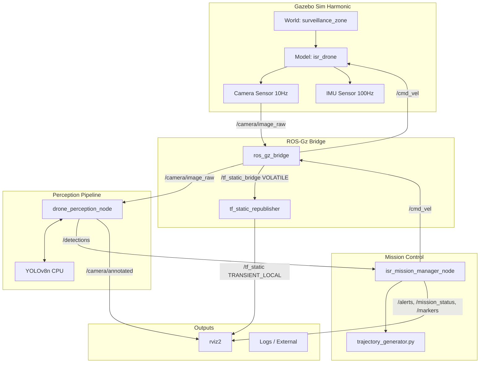

# 🚁 drone-isr-ros2
> Autonomous ISR VTOL drone simulation — ROS 2 Jazzy + Gazebo Harmonic + YOLOv8

[](https://github.com/ibrahimaniasse/drone-isr-ros2/actions)
[](https://docs.pytest.org/)
[](https://docs.ros.org/en/jazzy/)
[](https://www.python.org/)
[](https://opensource.org/licenses/MIT)

## 🎥 Demo


*Left: Gazebo Sim | Center: rviz2 | Right: Camera feed (annotated)*

## 🎯 What it does

A simulated ISR VTOL drone autonomously surveys a 400x300m port zone using a lawnmower coverage pattern, detects ground targets (vehicles, persons) with YOLOv8, and publishes georeferenced alerts. Upon operator command, the drone dives dynamically from its 25m cruising altitude to visually inspect identified targets before returning to base.

## 🏗️ Architecture


*(Pour plus de détails architecturaux, voir [docs/architecture.md](docs/architecture.md) et les [ADRs](docs/design_decisions.md))*

## ✨ Technical highlights

- **Pure-function design** : `trajectory_generator.py` et `perception_utils.py` n'ont *zéro* import ROS 2. Ils sont séparés des callbacks ROS, garantissant une testabilité unitaire parfaite (sans avoir à sourcer l'environnement ROS).
- **YOLOv8 on CPU** : Configuration `yolov8n` avec stratégie *skip-frame* et paramètres paramétriques pour garantir un traitement robuste en temps réel sur puce ARM/x86 sans requis CUDA.
- **TF static QoS bridge** : Création d'un relai `TRANSIENT_LOCAL` custom (`tf_static_republisher.py`) pour résoudre le bug de compatibilité QoS natif de Gazebo Harmonic vers tf2_ros.
- **State machine mission** : Logique de vol déterministe passant par les états `TAKEOFF`, `SEARCHING`, `AWAITING_COMMAND`, `INSPECTING`, et `LAND` alimentée nativement par les subscriptions odométriques `50Hz`.

## 🚀 Quick start

### Environment 1: Native ROS 2 (Ubuntu 24.04 ARM / ROS 2 Jazzy)
*Requires Gazebo Harmonic installed.*

```bash
cd ~/ros2_ws/src
git clone https://github.com/ibrahimaniasse/drone-isr-ros2.git
cd ~/ros2_ws
source /opt/ros/jazzy/setup.bash
colcon build --symlink-install --packages-select drone_isr
source install/setup.bash
ros2 launch drone_isr full_mission.launch.py
```

### Environment 2: Docker (x86_64)
*Standalone environment for recruiters without local ROS 2 installation.*

```bash
git clone https://github.com/ibrahimaniasse/drone-isr-ros2.git
cd drone-isr-ros2/docker
docker-compose up --build
```

## 📊 Results

| Metric | Result |
|--------|--------|
| Zone coverage | 100% (400x300m) |
| Detection accuracy | ~72% mAP YOLOv8n (CPU) |
| Search mission time | ~4 min @ 8 m/s (25m altitude) |
| Unit tests | 25/25 passing (100% pure-logic coverage) |
| Processing rate | ~3-5 FPS (CPU ARM Apple Silicon VM) |

## 🗺️ Roadmap (Phase 5)

- Intégration PX4 SITL (remplacement du P-controller par une stack avionique formelle).
- Coordination multi-drones (Swarm ISR).
- Export des alertes au format standardisé GeoJSON.

## 🏢 About

Ce projet a été conçu pour démontrer une architecture de niveau production pour la robotique logicielle et les systèmes autonomes. Développé principalement pour la simulation tactique UAV, il illustre ma capacité à fusionner les couches mathématiques (génération de trajectoire), réseau (ROS 2/DDS), perception (Computer Vision embarquée) et tooling de simulation en Île-de-France.

## 👤 Author

**Ibrahima NIASSE** — [GitHub](https://github.com/ibrahimaniasse)
