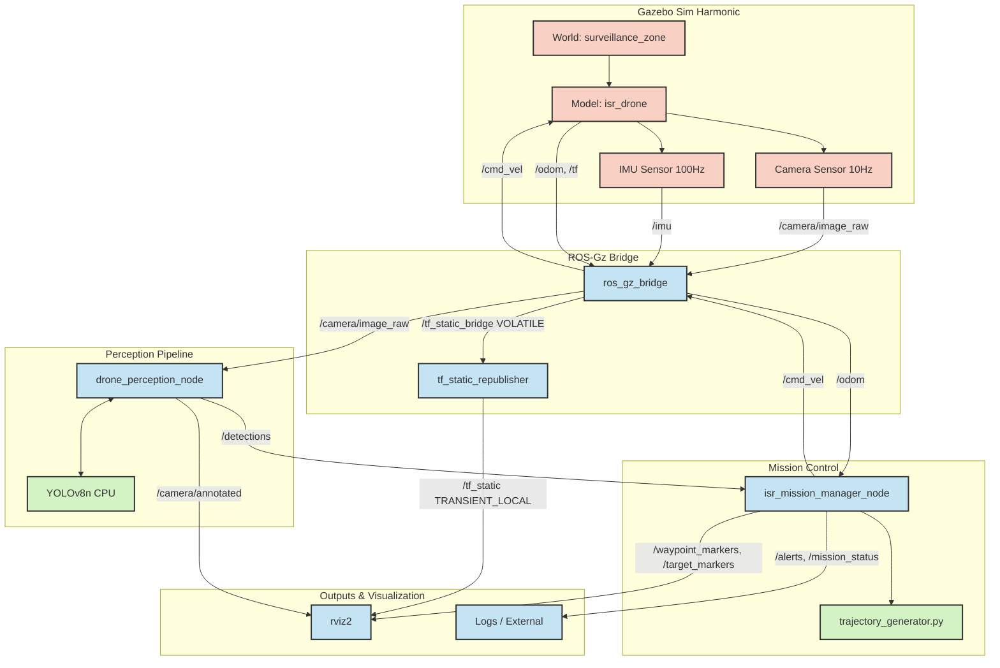

# Architecture — `drone-isr-ros2`

This document details the complete component and dataflow architecture of the drone-isr-ros2 simulation.

## System Diagram

The following Mermaid diagram outlines the 5 main system groups and their data interactions across the ROS2 and Gazebo Harmonic bridge.

## Communications (Topics)

| Topic | Type | Hz | Producer | Consumer |
|-------|------|----|----------|----------|
| `/camera/image_raw` | sensor_msgs/Image | 10 | Gazebo | drone_perception_node |
| `/camera/annotated` | sensor_msgs/Image | 3-5 | drone_perception_node | rviz2 |
| `/detections` | drone_isr/DetectionArray | 3-5 | drone_perception_node | isr_mission_manager |
| `/alerts` | drone_isr/Alert | event | isr_mission_manager | log/external |
| `/cmd_vel` | geometry_msgs/Twist | 10 | isr_mission_manager | Gazebo |
| `/odom` | nav_msgs/Odometry | 50 | Gazebo | isr_mission_manager |
| `/tf_static` | tf2_msgs/TFMessage | latched | tf_static_republisher | tf2 + rviz2 |
| `/waypoint_markers` | visualization_msgs/MarkerArray | 1 | isr_mission_manager | rviz2 |
| `/target_markers` | visualization_msgs/MarkerArray | event | isr_mission_manager | rviz2 |
